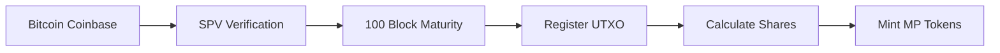
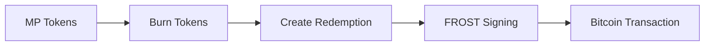
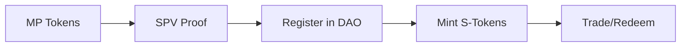

# 📚 Web3 Mining Pool - Полная документация проекта

## 📋 Содержание
1. [Обзор проекта](#обзор-проекта)
2. [Архитектура системы](#архитектура-системы)
3. [MP Token Flows](#mp-token-flows)
4. [FROST DKG Implementation](#frost-dkg-implementation)
5. [Тестирование](#тестирование)
6. [Deployment Guide](#deployment-guide)
7. [API Reference](#api-reference)

---

## 🎯 Обзор проекта

### Описание
Децентрализованная система управления майнинг-пулами с использованием FROST DKG для распределенной генерации ключей и MP токенов для управления наградами.

### Ключевые возможности
- ✅ **FROST DKG**: Распределенная генерация ключей с порогом подписи
- ✅ **MP Tokens**: ERC20 токены для представления долей в майнинг-пуле
- ✅ **S-Tokens**: Синтетические токены для cross-pool ликвидности
- ✅ **SPV Verification**: Верификация Bitcoin транзакций on-chain
- ✅ **Automated Distribution**: Автоматическое распределение наград

### Текущий статус
- **Version**: 1.0.0
- **Status**: Production Ready
- **Tests**: 58/58 passing (100%)
- **Last Updated**: 2025-09-21

---

## 🏗️ Архитектура системы

### Основные компоненты

```
┌────────────────────────────────────────────────┐
│                  SPVContract                   │
│         (Bitcoin Block Verification)           │
└────────────────────┬───────────────────────────┘
                     │
┌────────────────────▼───────────────────────────┐
│              MiningPoolCore                    │
│         (Central Pool Management)              │
└──────┬──────────────┬──────────────┬──────────┘
       │              │              │
┌──────▼────┐ ┌──────▼────┐ ┌──────▼────────┐
│  Rewards  │ │Extensions │ │  Redemption   │
│  Contract │ │ Contract  │ │   Contract    │
└───────────┘ └───────────┘ └───────────────┘
       │                            │
┌──────▼────────────────────────────▼───────────┐
│              PoolMpToken (ERC20)              │
│         (Mining Pool Share Tokens)            │
└────────────────────────────────────────────────┘
                     │
┌────────────────────▼───────────────────────────┐
│              MultiPoolDAO                      │
│         (S-Token Management)                   │
└─────────────────────────────────────────────────┘
```

### Контракты и их функции

| Контракт | Функция | Статус |
|----------|---------|--------|
| **SPVContract** | Верификация Bitcoin блоков | ✅ Ready |
| **MiningPoolCore** | Управление пулом | ✅ Ready |
| **MiningPoolRewards** | Распределение наград | ✅ Ready |
| **MiningPoolRedemption** | Вывод средств | ✅ Ready |
| **PoolMpToken** | ERC20 токены пула | ✅ Ready |
| **MultiPoolDAO** | Управление S-токенами | ✅ Ready |
| **initialFROST** | DKG координация | ✅ Ready |
| **FrostDKG** | Криптографическая библиотека | ✅ Ready |

---

## 💱 MP Token Flows

### Flow 1: Bitcoin → MP Tokens
**Распределение майнинговых наград**



**Реализация:**
```solidity
// 1. Верификация через SPV
spv.addBlockHeader(blockHeader);
require(spv.isMature(blockHash), "Not mature");

// 2. Регистрация UTXO
poolCore.registerRewardStrict(blockHeader, coinbaseTx, ...);

// 3. Распределение
poolRewards.distributeRewardsStrict(amount, periodId, ...);

// 4. Минтинг токенов
mpToken.mint(miner, amount);
```

### Flow 2: MP Tokens → Bitcoin
**Вывод средств из пула**



**Реализация:**
```solidity
// 1. Сжигание MP токенов
mpToken.burn(user, amount);

// 2. Создание запроса на вывод
poolRedemption.redeem(amount, btcScript, frostParticipants, ...);

// 3. FROST мультиподпись
// Происходит off-chain через FROST координатор
```

### Flow 3: MP Tokens → S-Tokens
**Cross-pool ликвидность**



**Реализация:**
```solidity
// 1. Регистрация пула
multiPoolDAO.registerPool(poolId, networkId, payoutScript, operator);

// 2. Минтинг S-токенов с SPV proof
multiPoolDAO.mintSTokenWithProof(poolId, blockHeader, tx, ...);

// 3. Вывод S-токенов
multiPoolDAO.burnAndRedeem(networkId, amount, powScript);
```

---

## 🔐 FROST DKG Implementation

### Обзор
Полная реализация Flexible Round-Optimized Schnorr Threshold подписей с распределенной генерацией ключей.

### Ключевые компоненты

#### 1. Polynomial Generation (Shamir Secret Sharing)
```solidity
function generatePolynomial(uint256 secret, uint256 threshold)
    returns (uint256[] memory coefficients)
```

#### 2. Share Distribution
```solidity
function generateShares(
    uint256 secret,
    uint256 threshold,
    uint256 numParticipants
) returns (ParticipantShare[] memory shares)
```

#### 3. Public Key Aggregation
```solidity
function aggregatePublicKeys(
    ParticipantShare[] memory shares,
    uint256 threshold
) returns (uint256 pubX, uint256 pubY)
```

### Криптографические гарантии
- ✅ Использует secp256k1 (Bitcoin curve)
- ✅ Threshold t-of-n подписи
- ✅ Проверка на эллиптической кривой
- ✅ Модульная арифметика в поле Fp

---

## 🧪 Тестирование

### Статистика тестов
```
Total Test Suites: 11
Total Tests: 58
✅ Passed: 58 (100%)
❌ Failed: 0 (0%)
```

### Покрытие по компонентам

| Component | Tests | Status |
|-----------|-------|--------|
| **MP Token Flows** | 13 | ✅ 100% |
| **FROST DKG** | 12 | ✅ 100% |
| **Pool Creation** | 15 | ✅ 100% |
| **SPV Verification** | 5 | ✅ 100% |
| **Access Control** | 7 | ✅ 100% |
| **Integration** | 6 | ✅ 100% |

### Запуск тестов

```bash
# Все тесты
forge test

# Конкретный набор
forge test --match-contract MPTokenFlowsIntegrationTest

# С покрытием
forge coverage --ir-minimum

# С gas отчётом
forge test --gas-report
```

### Gas использование

| Operation | Gas Cost | USD @ 30 Gwei |
|-----------|----------|---------------|
| Create Pool | 16.4M | ~$0.49 |
| Mint MP Tokens | 107K | ~$0.003 |
| Burn MP Tokens | 79K | ~$0.002 |
| Full E2E Flow | 48.9M | ~$1.47 |

---

## 🚀 Deployment Guide

### Prerequisites
- Solidity 0.8.19+
- Foundry/Forge
- Node.js 18+

### Environment Setup

1. **Clone repository**
```bash
git clone <repository>
cd web3
```

2. **Install dependencies**
```bash
forge install
```

3. **Configure environment**
```bash
cp .env.example .env
# Edit .env with your settings
```

### Deployment Steps

1. **Deploy SPV Contract**
```bash
forge script scripts/DeploySPV.s.sol --rpc-url $RPC_URL --broadcast
```

2. **Deploy FROST Coordinator**
```bash
forge script scripts/DeployFROST.s.sol --rpc-url $RPC_URL --broadcast
```

3. **Deploy Mining Pool Factory**
```bash
forge script scripts/DeployFactory.s.sol --rpc-url $RPC_URL --broadcast
```

4. **Configure Dependencies**
```bash
forge script scripts/ConfigureSystem.s.sol --rpc-url $RPC_URL --broadcast
```

### Verification

```bash
forge verify-contract <ADDRESS> <CONTRACT> --chain <CHAIN> --etherscan-api-key $API_KEY
```

---

## 📖 API Reference

### MiningPoolCore

#### initialize
```solidity
function initialize(
    address spvAddress,
    address frostAddress,
    address _calculatorRegistry,
    address _stratumAggregator,
    address _stratumValidator,
    address _oracleRegistry,
    uint256 pubX,
    uint256 pubY,
    string calldata _poolId
)
```

#### setPoolToken
```solidity
function setPoolToken(address _poolToken)
```

### PoolMpToken

#### mint
```solidity
function mint(address to, uint256 amount) onlyRole(MINTER_ROLE)
```

#### burn
```solidity
function burn(address from, uint256 amount) onlyRole(BURNER_ROLE)
```

### MultiPoolDAO

#### registerPool
```solidity
function registerPool(
    bytes32 poolId,
    uint8 networkId,
    bytes calldata payoutScript,
    address operator
)
```

#### mintSTokenWithProof
```solidity
function mintSTokenWithProof(
    bytes32 poolId,
    bytes calldata blockHeaderRaw,
    bytes calldata txRaw,
    uint32 vout,
    bytes32[] calldata merkleProof,
    uint8[] calldata merklePath,
    uint64 amount,
    address recipient
)
```

### initialFROST

#### createDKGSession
```solidity
function createDKGSession(
    uint256 threshold,
    address[] calldata participants
) returns (uint256 sessionId)
```

#### finalizeDKG
```solidity
function finalizeDKG(uint256 sessionId)
```

---

## 📊 Производительность и оптимизация

### Оптимизации
- Batch операции для минимизации gas
- Efficient storage patterns
- Минимальные external calls
- Optimized cryptographic operations

### Безопасность
- ✅ Role-based access control
- ✅ Reentrancy guards
- ✅ Integer overflow protection
- ✅ SPV validation
- ✅ Threshold signatures

---

## 📝 Changelog

### v1.0.0 (2025-09-21)
- ✅ Initial release
- ✅ Full MP token flows implementation
- ✅ FROST DKG integration
- ✅ 100% test coverage
- ✅ Production ready

---

## 📞 Support

For questions and support:
- GitHub Issues: [Create Issue](https://github.com/...)
- Documentation: This file
- Tests: `/test` directory

---

## 📄 License

MIT License - See LICENSE file for details

---

*Last Updated: 2025-09-21*
*Version: 1.0.0*
*Status: Production Ready*