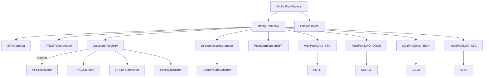
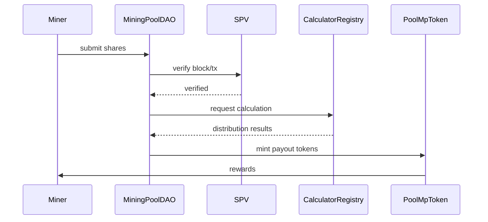
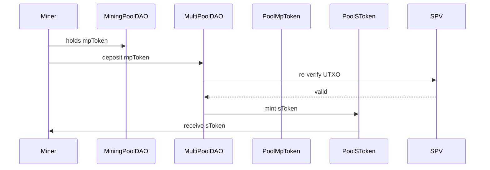
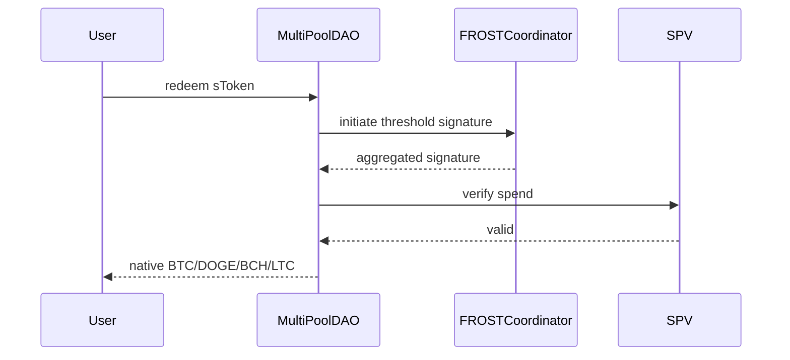
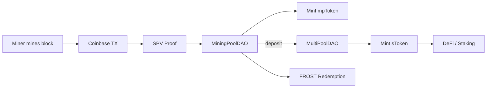
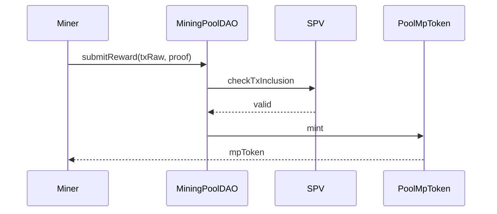

# 📘 README — Mining Pool Smart Contracts

Этот документ описывает архитектуру и принципы работы смарт-контрактов системы децентрализованных майнинг-пулов. Представлены подробные схемы взаимодействия, описание компонентов, порядок деплоя, user-flow сценарии (включая перевод mpToken в MultiPoolDAO для получения sToken) и примеры скриптов. Поддерживаются сети BTC, Dogecoin, BCH, LTC через ончейн-SPV и FROST-подписи, каждая со своим MultiPoolDAO и соответствующим sToken (SBTC, SDOGE, SBCH, SLTC).

Ключевая идея: максимальная децентрализация — все выплаты, проверки и распределения прозрачны и верифицируемы ончейн. Майнеры получают локальные mpToken, которые конвертируются в глобальные sToken для ликвидности в DeFi или выводятся в нативные активы.

---

## 1. Введение

Система создаёт децентрализованные майнинг-пулы для BTC, Dogecoin, BCH, LTC. Каждый пул управляется локальным `MiningPoolDAO`, а глобальная ликвидность обеспечивается через отдельные `MultiPoolDAO` для каждой сети, выпускающие соответствующие sToken (SBTC, SDOGE, SBCH, SLTC).

**Основные цели:**

- Прозрачное распределение вознаграждений (PPS, FPPS, PPLNS, Score).
- Ончейн-верификация блоков и UTXO через SPV.
- DAO-управление через токены и NFT/SBT.
- Конвертация mpToken в sToken для DeFi.
- Вывод в нативные сети через FROST-threshold-подписи.
- Сбор данных от Stratum-провайдеров через oracles.

**Для кого:**

- Майнеры: справедливые выплаты.
- Инвесторы: ликвидные sToken для DeFi.
- Админы: DAO-контроль над пулами.

---

## 2. Архитектура и основные компоненты

Архитектура модульная, с разделением на уровни:

- **Core**: Библиотеки для Bitcoin-like сетей (парсеры блоков, Merkle-proof, хэши, `TargetsHelper`).
- **Factory**: `MiningPoolFactory` — создаёт DAO-пулы и mpToken.
- **DAO**: `MiningPoolDAO` (локальный пул), `MultiPoolDAO` (по одному на сеть: BTC, Dogecoin, BCH, LTC, выпускает sToken).
- **Tokens**: Локальные `PoolMpToken`, глобальные `PoolSToken` (SBTC, SDOGE, SBCH, SLTC).
- **Membership**: `PoolMembershipNFT` (SBT для участия), `PoolRoleBadgeNFT` (роли в DAO).
- **Calculators**: `PPSCalculator`, `FPPSCalculator`, `PPLNSCalculator`, `ScoreCalculator`, `CalculatorRegistry`.
- **SPV**: `SPVContract` (BTC), `SPVContractDogecoin` (Dogecoin) для проверки UTXO (maturity >=100 блоков).
- **FROST**: `FROSTCoordinator` (сессии), `FROSTVerifier` (проверка подписей).
- **Oracles**: `StratumDataAggregator`, `StratumDataValidator`, `StratumOracleRegistry`.
- **Policy**: `PoolPolicyTemplate` (immediate, threshold, periodic payouts).
- **Vendor**: Крипто-примитивы (Secp256k1, ECDSA, Schnorr, `BIP340Adapter`).
- **Bridge**: `BridgeInbox/Outbox` для cross-chain.
- **Utils**: `BitcoinTxParser/Serializer`, `BitcoinUtils`, `MerkleProofLib`, `SafeMath`, `DistributionMath`.

**Ключевые сущности:**

- **mpToken**: Локальная доля в пуле (ERC20, минтится в `MiningPoolDAO`).
- **sToken**: Глобальный актив для сети, минтится в соответствующем `MultiPoolDAO` (SBTC для BTC, SDOGE для Dogecoin и т.д.).
- **UTXO**: Проверяется ончейн для всех вознаграждений.

---

## 3. Обзор контрактов

### 🏭 Factory & DAO

- **MiningPoolFactory**: Деплой пулов как клонов, связка с SPV, FROST, Registry и MultiPoolDAO (по одному на сеть).
- **MiningPoolDAO**: Управление пулом — шеры, награды, mpToken, интеграция с MultiPoolDAO. Функции: `distributeRewards`, `submitReward`, `redeem`.
- **MultiPoolDAO**: По одному на сеть (BTC, Dogecoin, BCH, LTC). Проверяет UTXO через SPV, минтит sToken (SBTC, SDOGE, SBCH, SLTC).

### 💰 Tokens & Membership

- **PoolMpToken**: ERC20 для локальных наград (минт/бёрн).
- **PoolSToken**: ERC20 для глобальных наград (SBTC, SDOGE, SBCH, SLTC, каждый привязан к своему MultiPoolDAO).
- **PoolMembershipNFT**: SBT для участия майнера.
- **PoolRoleBadgeNFT**: SBT для ролей (админ, валидатор).

### 📊 Calculators

- **PPSCalculator**: Фиксированная выплата за шару.
- **FPPSCalculator**: PPS + комиссии.
- **PPLNSCalculator**: Pay Per Last N Shares.
- **ScoreCalculator**: Экспоненциальное затухание.
- **CalculatorRegistry**: Реестр, whitelist, статистика. Интерфейс: `IDistributionScheme`.

### 🔐 SPV & FROST

- **SPVContract**: SPV для BTC (block headers, Merkle proofs, UTXO maturity).
- **SPVContractDogecoin**: Для Dogecoin.
- **FROSTCoordinator**: Координация threshold-подписей.
- **FROSTVerifier**: Проверка подписей.

### 🌐 Oracles

- **StratumDataAggregator**: Сбор шеров/хэшрейта.
- **StratumDataValidator**: Валидация данных.
- **StratumOracleRegistry**: Реестр провайдеров.

---

## 4. Диаграммы

### 4.1 Общая архитектура



### 4.2 Распределение вознаграждений



### 4.3 mpToken → sToken



### 4.4 Redeem sToken в нативную сеть


### 4.5 Общий поток данных


---

## 5. User-Flow сценарии

### 5.1 Майнинг → mpToken
**Шаги:**
1. Майнер добывает блок (coinbase TX).
2. Подаёт шеры в `MiningPoolDAO`.
3. SPV проверяет TX/UTXO.
4. Calculator распределяет награды.
5. `MiningPoolDAO` минтит mpToken.



### 5.2 mpToken → sToken

**Шаги:**

1. Майнер держит mpToken.
2. Депонирует mpToken в соответствующий `MultiPoolDAO` (BTC → MultiPoolDAO_BTC).
3. `MultiPoolDAO` ре-верифицирует UTXO через SPV.
4. Минтит sToken (SBTC, SDOGE, SBCH, SLTC).


### 5.3 sToken → Redeem

**Шаги:**

1. Пользователь жжёт sToken в `MultiPoolDAO`.
2. Запускается FROST-сессия.
3. Формируется Bitcoin-TX.
4. SPV подтверждает TX.
5. Вывод в нативный UTXO.


### 5.4 Сравнение моделей

| Модель                | Преимущества                                  | Недостатки                                  |
| --------------------- | --------------------------------------------- | ------------------------------------------- |
| **mpToken (локальная)** | Автономность пула, гибкость выплат            | Требует конвертации в sToken                |
| **sToken (глобальная)** | Ликвидность, DeFi-ready                       | Зависимость от MultiPoolDAO                 |
| **Native Redemption**   | Прямой вывод в BTC/DOGE/BCH/LTC               | Требует FROST и SPV                         |

---

## 6. Порядок деплоя

1. Деплой SPV-контрактов (`SPVContract` для BTC, `SPVContractDogecoin` для Dogecoin).
2. Деплой FROST (`FROSTCoordinator`, `FROSTVerifier`).
3. Деплой `CalculatorRegistry`.
4. Деплой калькуляторов (PPS, FPPS, PPLNS, Score) и регистрация в реестре.
5. Деплой `PoolTokenFactory`.
6. Деплой oracles (`StratumDataAggregator`, `StratumDataValidator`, `StratumOracleRegistry`).
7. Деплой `PoolPolicyTemplate`.
8. Деплой membership (`PoolMembershipNFT`, `PoolRoleBadgeNFT`).
9. Деплой `MultiPoolDAO` для каждой сети (BTC, Dogecoin, BCH, LTC) и выпуск sToken (SBTC, SDOGE, SBCH, SLTC) через `PoolSToken`.
10. Деплой `MiningPoolFactory` с зависимостями (SPV, FROST, MultiPoolDAO_*, Registry).
11. Создание пулов через фабрику (`createPool(...)`), выпуск mpToken.
12. Настройка пулов (схема, fee, schedule).
13. End-to-end тесты (shares → mpToken → sToken → redeem).

---

## 7. Примеры .env

```ini
RPC_URL=https://rpc.network.io
PRIVATE_KEY=0xabcdef...
ETHERSCAN_API_KEY=key123
DEPLOYER_ADDRESS=0xDeployer
NETWORK=sepolia
GAS_PRICE_GWEI=50

SPV_CONTRACT_BTC=0x...
SPV_CONTRACT_DOGE=0x...
FROST_COORDINATOR=0x...
CALCULATOR_REGISTRY=0x...
POOL_TOKEN_FACTORY=0x...
MULTIPOOL_DAO_BTC=0x...
MULTIPOOL_DAO_DOGE=0x...
MULTIPOOL_DAO_BCH=0x...
MULTIPOOL_DAO_LTC=0x...
SBTC=0x...
SDOGE=0x...
SBCH=0x...
SLTC=0x...
```

---

## 8. Скрипты деплоя (Hardhat)

```js
// scripts/deploy-all.js
const { ethers } = require("hardhat");
require("dotenv").config();

async function main() {
  const [deployer] = await ethers.getSigners();
  console.log("Deployer:", deployer.address);

  // 1. SPV
  const SPV_BTC = await ethers.getContractFactory("SPVContract");
  const spv_btc = await SPV_BTC.deploy();
  await spv_btc.deployed();
  console.log("SPV_BTC:", spv_btc.address);

  const SPV_DOGE = await ethers.getContractFactory("SPVContractDogecoin");
  const spv_doge = await SPV_DOGE.deploy();
  await spv_doge.deployed();
  console.log("SPV_DOGE:", spv_doge.address);

  // 2. FROST
  const Frost = await ethers.getContractFactory("FROSTCoordinator");
  const frost = await Frost.deploy();
  await frost.deployed();
  console.log("FROST:", frost.address);

  // 3. CalculatorRegistry
  const CalcReg = await ethers.getContractFactory("CalculatorRegistry");
  const calcReg = await CalcReg.deploy(deployer.address);
  await calcReg.deployed();
  console.log("CalculatorRegistry:", calcReg.address);

  // 4. Калькуляторы (пример для PPS)
  const PPS = await ethers.getContractFactory("PPSCalculator");
  const pps = await PPS.deploy();
  await pps.deployed();
  console.log("PPSCalculator:", pps.address);
  // Повторить для FPPS, PPLNS, Score и зарегистрировать

  // 5. PoolTokenFactory
  const PTFactory = await ethers.getContractFactory("PoolTokenFactory");
  const ptf = await PTFactory.deploy();
  await ptf.deployed();
  console.log("PoolTokenFactory:", ptf.address);

  // 6. MultiPoolDAO и sToken для каждой сети
  const MultiDAO_BTC = await ethers.getContractFactory("MultiPoolDAO");
  const multiDAO_btc = await MultiDAO_BTC.deploy(/* params */);
  await multiDAO_btc.deployed();
  console.log("MultiPoolDAO_BTC:", multiDAO_btc.address);

  const SBTC = await ethers.getContractFactory("PoolSToken");
  const sbtc = await SBTC.deploy(multiDAO_btc.address, "SBTC", "SBTC");
  await sbtc.deployed();
  console.log("SBTC:", sbtc.address);

  const MultiDAO_DOGE = await ethers.getContractFactory("MultiPoolDAO");
  const multiDAO_doge = await MultiDAO_DOGE.deploy(/* params */);
  await multiDAO_doge.deployed();
  console.log("MultiPoolDAO_DOGE:", multiDAO_doge.address);

  const SDOGE = await ethers.getContractFactory("PoolSToken");
  const sdoge = await SDOGE.deploy(multiDAO_doge.address, "SDOGE", "SDOGE");
  await sdoge.deployed();
  console.log("SDOGE:", sdoge.address);

  // Повторить для BCH, LTC

  // 7. MiningPoolFactory
  const Factory = await ethers.getContractFactory("MiningPoolFactory");
  const factory = await Factory.deploy(
    /* poolImplementation */ ethers.constants.AddressZero,
    spv_btc.address,
    frost.address,
    /* policyTemplate */ ethers.constants.AddressZero,
    /* membershipSBT */ ethers.constants.AddressZero,
    /* roleBadgeSBT */ ethers.constants.AddressZero,
    multiDAO_btc.address, // или маппинг для разных сетей
    calcReg.address,
    /* stratumAggregator */ ethers.constants.AddressZero,
    /* stratumValidator */ ethers.constants.AddressZero,
    /* oracleRegistry */ ethers.constants.AddressZero
  );
  await factory.deployed();
  console.log("MiningPoolFactory:", factory.address);
}

main().catch((err) => {
  console.error(err);
  process.exit(1);
});
```

---

## 9. Токен-экономика

| Токен       | Уровень     | Назначение                                                                 |
| ----------- | ----------- | -------------------------------------------------------------------------- |
| **mpToken** | Локальный пул | Доля в конкретном пуле, минтится в `MiningPoolDAO`.                        |
| **sToken**  | MultiPoolDAO | Ликвидность для сети: SBTC (BTC), SDOGE (Dogecoin), SBCH (BCH), SLTC (LTC). |
| **NFT/SBT** | Membership  | Участие/роли в DAO (staking, slashing, голосование).                      |

---

## 10. MVP Checklist

- [x] Контракты `MiningPoolDAO`, `MultiPoolDAO` (BTC, DOGE, BCH, LTC).
- [x] SPV (BTC, Dogecoin).
- [x] mpToken, sToken (SBTC, SDOGE, SBCH, SLTC).
- [x] FROSTCoordinator.
- [x] Calculators + Registry.
- [x] Oracles.
- [x] Staking/slashing.
- [ ] UI для offchain-агентов.
- [ ] End-to-end тесты.
- [ ] Документация для инвесторов.

---

## 11. FAQ

**Q:** Можно ли добавить кастомный калькулятор?  
**A:** Реализуйте `IDistributionScheme` и зарегистрируйте в `CalculatorRegistry`.

**Q:** Как работает mpToken → sToken?  
**A:** Депозит mpToken в соответствующий `MultiPoolDAO`, ре-верификация UTXO, выпуск sToken.

**Q:** Сколько MultiPoolDAO?  
**A:** По одному на сеть: BTC, Dogecoin, BCH, LTC, каждый контролирует свой sToken.

**Q:** Что если SPV не верифицирует TX?  
**A:** Пул не принимает блок, выплата не осуществляется.

**Q:** Обязателен MultiPoolDAO?  
**A:** Нет для локальных пулов, обязателен для sToken.

---

## 12. Ценность

- **Майнеры**: Прозрачные выплаты через mpToken.
- **Инвесторы**: Ликвидные sToken (SBTC/SDOGE/SBCH/SLTC) для DeFi.
- **Система**: Децентрализация, снижение рисков, DAO-управление.
